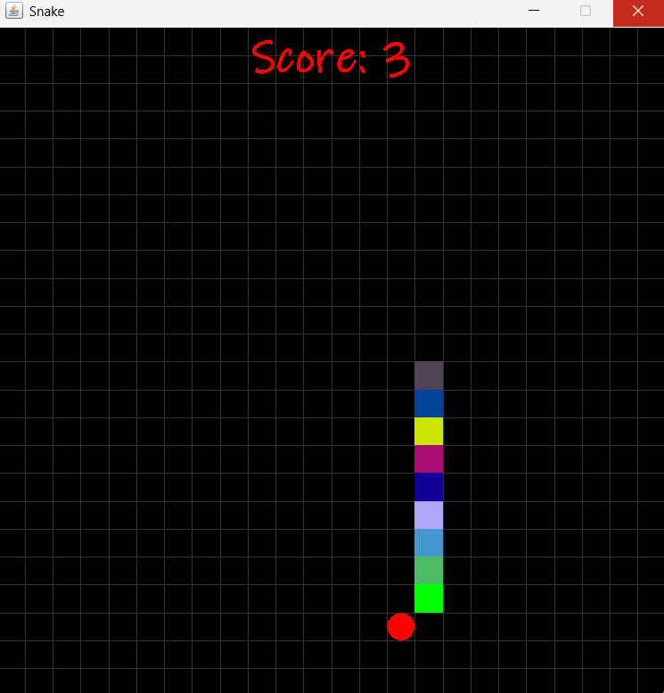
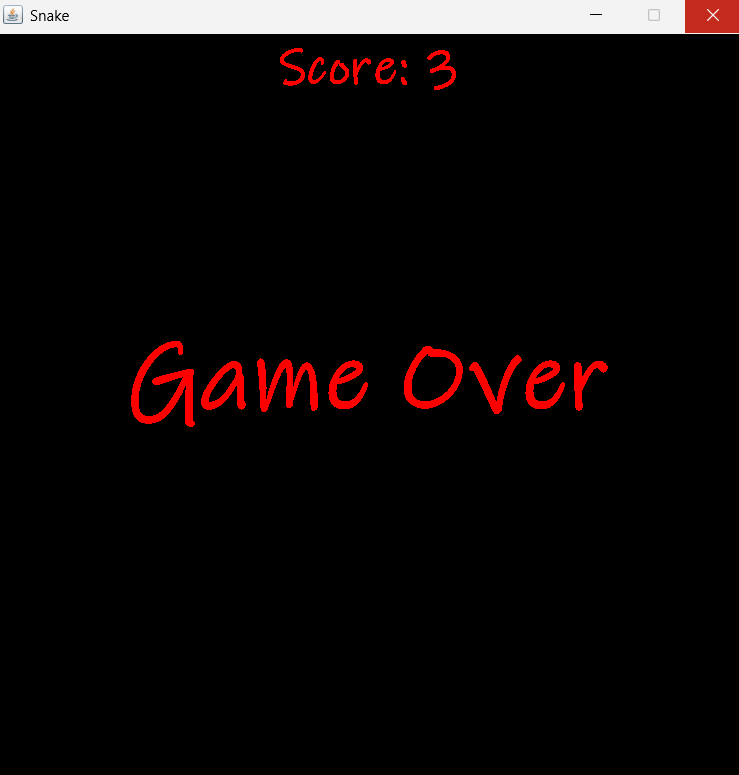

# 🐍 Snake Game (Java)

A classic **Snake Game** built using **Java Swing**, inspired by the vintage mobile games we all used to play.  
This project demonstrates core concepts of **Java GUI development, event handling, and game logic**.

---

## 🎮 Gameplay Preview



---

## 💀 Game Over Screen



---

## 🚀 Features

- 🎯 Smooth snake movement using keyboard controls  
- 🍎 Random apple generation  
- 📈 Score tracking system  
- 💀 Collision detection (walls & self)  
- ⏱️ Real-time game loop using Timer  
- 🎨 Simple and clean UI using Java Swing  

---

## 🛠️ Tech Stack

- **Java**
- **Java Swing (GUI)**
- **AWT Event Handling**

---

## ▶️ How to Run

### 1. Clone the repository
```bash
git clone https://github.com/your-username/snake-game-java.git
cd snake-game-java 

### 2. Compile the code
javac GameFrame.java

### 3. Run the game
java GameFrame

### 📚 What I Learned
Building GUI applications using Java Swing
Handling keyboard events with KeyListener
Implementing game loops using Timer
Managing state and collision detection in games
Writing clean and structured object-oriented code
